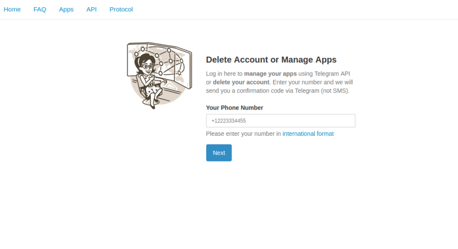
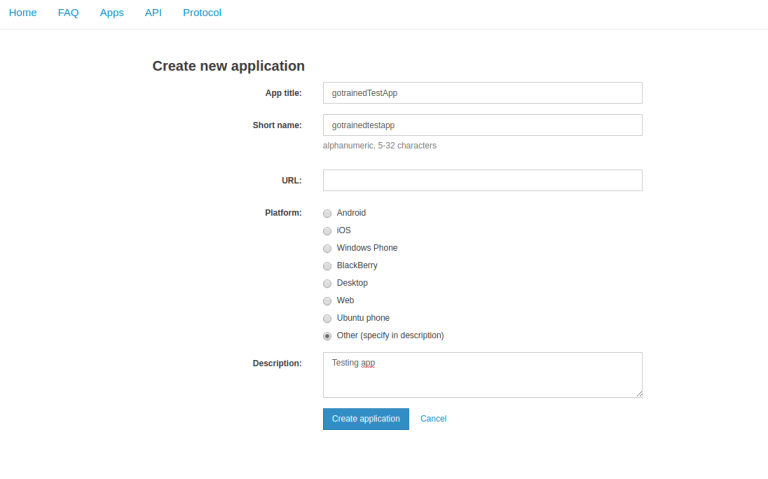
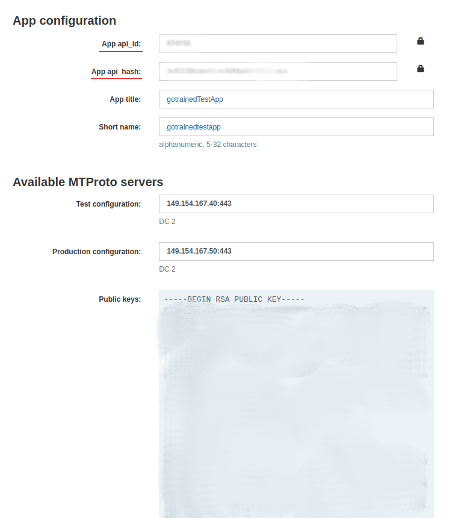

# HOW TO USE

## Create a Telegram App and Get Your Credentialss

1. Go to my.telegram.org and log in.
   

2. Click on API development tools and fill the required fields.
   

3. You can choose any name for your app. After submitting, you will receive api_id and api_hash. Save them somewhere. You will use these credentials to login to Telegram API.
   

4. Install Telethon

   You can install telethon using pip: `pip install telethon`

5. Run `py main.py path/to/csv_file.csv`
